# SwiftDash Food Delivery — Operations & Customer Analytics

[](https://python.org)
[](tests/)
[](https://mysql.com)
[](https://powerbi.microsoft.com)
[](LICENSE)

End-to-end analytics project for a food delivery platform. Covers the full workflow — data generation, cleaning, SQL analysis, and an interactive Power BI dashboard — using Python, MySQL, and Power BI.

Built as a portfolio project for **Data Analyst / BI Analyst / Business Analyst** internship and placement interviews.

---

## Quick Look

| Metric | Value |
|--------|-------|
| Orders analysed | 65,000+ |
| Customers | 12,000 |
| Restaurants | 250 |
| Delivery partners | 800 |
| Cities | 15 |
| SQL queries | 50 |
| Test coverage | 42 unit & integration tests |

---

## Repository Structure

```
swiftdash-ops-analytics/
│
├── run_pipeline.py          # One-command pipeline runner
├── config.py                # Centralised paths & constants
├── requirements.txt
├── LICENSE
├── CONTRIBUTING.md
│
├── scripts/
│   ├── generate_data.py           # Synthetic data generation
│   ├── clean_data.py              # Data cleaning & validation
│   ├── feature_engineering.py     # RFM, segments, aggregations
│   ├── generate_visualizations.py # EDA & Power BI-style dashboard screenshots
│   ├── load_to_mysql.py           # MySQL bulk loader
│   └── build_powerbi.py           # Power BI PbixProj generator
│
├── notebooks/
│   └── 01_exploratory_data_analysis.ipynb
│
├── sql/
│   ├── 01_schema.sql              # DB schema (6 tables, FKs, indexes)
│   ├── 02_revenue_analysis.sql    # 10 revenue queries
│   ├── 03_customer_analysis.sql   # 10 customer queries
│   ├── 04_operational_analysis.sql# 10 operations queries
│   ├── 05_restaurant_analysis.sql # 10 restaurant queries
│   └── 06_kpi_dashboard.sql       # 10 KPI & executive queries
│
├── docs/
│   ├── data_dictionary.md         # Column-level documentation
│   └── er_diagram.md              # Entity-relationship diagram (Mermaid)
│
├── dashboard/
│   ├── swiftdash_dashboard.pbip/  # PbixProj folder (model, mashup, report)
│   │   └── model/.tmdl/           # TMDL — 9 tables + Calendar + 25 DAX measures
│   ├── swiftdash_measures.dax     # DAX measures (reference copy)
│   └── swiftdash_dashboard.pbit   # Power BI Template (open & refresh)
│
├── tests/
│   ├── test_cleaning.py           # 20 data cleaning tests
│   ├── test_features.py           # 4 feature engineering tests
│   └── test_pipeline_integrity.py # 16 pipeline integrity tests
│
├── reports/
│   ├── business_recommendations.md
│   ├── power_bi_dashboard_guide.md
│   ├── interview_questions.md
│   └── resume_bullets.md
│
├── screenshots/                   # EDA & dashboard exports
└── logs/                          # Pipeline execution logs
```

---

## Pipeline

```
                        ┌──────────────┐
                        │  config.py   │
                        └──────┬───────┘
                               │
                   ┌───────────┴───────────┐
                   │    run_pipeline.py     │
                   └───────────┬───────────┘
                               │
         ┌─────────────────────┼─────────────────────┐
         ▼                     ▼                     ▼
  generate_data.py      clean_data.py      feature_engineering.py
         │                     │                     │
    Raw CSVs             Cleaned CSVs           Processed tables
         │                     │                     │
         └─────────────────────┼─────────────────────┘
                               ▼
                        load_to_mysql.py
                               │
                          MySQL DB
                               │
                       50 SQL queries
                               │
                     Power BI dashboard
                               │
                 Business insights & recommendations
```

Run everything with a single command:

```bash
python run_pipeline.py
```

---

## Tech Stack

| Layer | Technology |
|-------|-----------|
| Language | Python 3.10+ |
| Data processing | Pandas, NumPy |
| Visualisation | Matplotlib, Seaborn |
| Database | MySQL 8.0 |
| SQL techniques | CTEs, window functions (`LAG`, `NTILE`, `ROW_NUMBER`), cohort analysis, self-joins, conditional aggregation |
| Dashboard | Power BI (DAX measures, drill-through, time intelligence, slicers) |
| Testing | pytest (40 tests) |
| Logging | Python `logging` module → `logs/pipeline.log` |
| Version control | Git, GitHub |

---

## Dataset

Synthetically generated using Faker + NumPy with realistic distributions: peak-hour ordering, weekday/weekend variation, weather impact on delivery times, and seasonal trends.

| Table | Rows | Key columns |
|-------|------|-------------|
| `customers` | 12,000 | age, gender, city, signup_date, is_active |
| `restaurants` | 250 | cuisine_type, rating, preparation_time_mins |
| `drivers` | 800 | vehicle_type, rating, is_active |
| `orders` | 65,000 | total_amount, payment_method, order_status, surge_multiplier |
| `order_items` | 134,383 | item_name, category, quantity, unit_price |
| `delivery_logs` | 59,767 | travel_time_mins, distance_km, traffic, weather, is_on_time |

[Full data dictionary](docs/data_dictionary.md) · [ER diagram](docs/er_diagram.md)

---

## Database Schema (MySQL)

Six tables with foreign keys, indexes, `ON DELETE` rules, and audit timestamps:

```
customers  1───* orders *───1 restaurants
                   │
                   *
             order_items
                   │
                   1
                   │
            delivery_logs  *───1 drivers
```

- **`ON DELETE RESTRICT`** on customer/restaurant FKs (prevents orphan orders)
- **`ON DELETE SET NULL`** on driver FK (cancelled orders have no driver)
- **`ON DELETE CASCADE`** on order_items / delivery_logs (clean deletion)
- Indexes on `order_date`, `customer_id`, `restaurant_id`, `order_status`, `payment_method`
- `created_at` / `updated_at` timestamps on every table

---

## SQL Analysis — 50 Queries

### Revenue (10 queries)
Monthly revenue with MoM growth (`LAG`), revenue by payment method / city / hour / cuisine, revenue lost to cancellations, discount impact analysis, weekday vs weekend comparison.

### Customer (10 queries)
RFM segmentation (Platinum/Gold/Silver/At Risk/Churned with documented thresholds), customer lifetime value ranking, repeat customer rate, cohort retention analysis, age/gender analysis, acquisition trends, preferred payment methods.

### Operations (10 queries)
Delivery time by hour / traffic / weather, driver efficiency ranking, vehicle type comparison, peak hour analysis, outlier detection (deliveries > 60 min), refund rate (CTE-based).

### Restaurant (10 queries)
Top restaurants by revenue, cuisine performance, most popular items, cross-selling analysis (self-join market basket), cancellation rate by restaurant, revenue concentration (Pareto via `NTILE`), cuisine popularity by city.

### KPI Dashboard (10 queries)
Executive scorecard, MoM KPI comparison, top 10% customer contribution (`NTILE`), daily active users, payment adoption trends, cohort retention, customer LTV trend, platform economics breakdown, surge pricing analysis, business health scorecard.

---

## Power BI Dashboard

The dashboard is available as a **PbixProj folder** ([open-source format](https://pbi.tools/)) that can be compiled into a `.pbit` template and then opened in Power BI Desktop.

### Quick start (PbixProj → .pbit → .pbix)

**Option A — pbi-tools** (requires Power BI Desktop v2.155.x installed):

```bash
python scripts/build_powerbi.py                           # generate PbixProj
pbi-tools compile dashboard/swiftdash_dashboard.pbip \
            dashboard/swiftdash_dashboard.pbit PBIT True  # compile .pbit
```

**Option B — Power BI Desktop**:

1. Open `dashboard/swiftdash_dashboard.pbit` (or the `.pbit` generated above)
2. Data → Transform Data → Source → point CSV paths to your `data/cleaned/` and `data/processed/`
3. Close & Apply → model loads and relationships are ready
4. All 5 report pages are pre‑laid out; use the Fields pane to bind visuals
5. File → Save As → `.pbix`

> **Note:** The PbixProj uses `"modelSerialization": "Raw"` (TMSL JSON). The model is stored as a single `Model/database.json` file. This avoids TMDL parser incompatibilities between pbi-tools and Power BI Desktop v2.155.

### What's included

| Artifact | Description |
|----------|-------------|
| `dashboard/swiftdash_dashboard.pbip/` | PbixProj with TMSL model (10 tables), M queries, report layout |
| `dashboard/swiftdash_measures.dax` | All 25+ DAX measures as reference text |
| `dashboard/swiftdash_dashboard.pbit` | Compiled Power BI Template (open → refresh → save as .pbix) |

### Data model

TMSL definition at `dashboard/swiftdash_dashboard.pbip/Model/database.json`:

- **9 fact/dimension tables**: customers, restaurants, drivers, orders, order_items, delivery_logs, customer_features, restaurant_features, daily_metrics
- **Calendar table**: date, year, quarter, month, weekday, is_weekend
- **Relationships**: 9 defined — orders ↔ customers/restaurants/drivers, order_items ↔ orders, delivery_logs ↔ orders/drivers, feature tables ↔ dimensions
- **25+ DAX measures** including: Total Revenue, Cancellation Rate, On‑Time Delivery Rate, Repeat Customer Rate, Revenue MoM/YoY Growth, Revenue MTD/QTD/YTD, Surge Revenue Premium, Peak Hour Orders

### 5 Dashboard Pages

1. **Executive Summary** — KPI cards, monthly revenue trend, top cities
2. **Customer Analytics** — segment pie, revenue by segment, CLV, repeat rate, time patterns
3. **Restaurant Analytics** — cuisine revenue, revenue tiers, top restaurants, cancellation rates
4. **Delivery Operations** — travel time distribution, on‑time rate by traffic/weather, vehicle mix
5. **Business Insights** — MoM growth %, payment mix, weekday/weekend comparison, payment AOV

[Full dashboard build guide](reports/power_bi_dashboard_guide.md)

---

## Dashboard Preview

5-page Power BI dashboard built on the data model (PbixProj in `dashboard/`):

| Executive Summary | Customer Analytics | Restaurant Analytics |
|:---:|:---:|:---:|
| 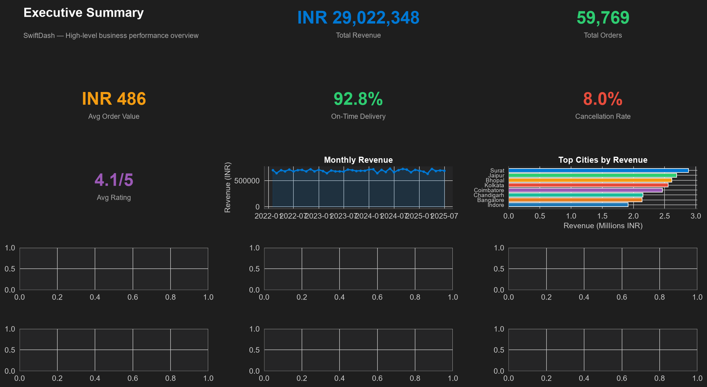 | 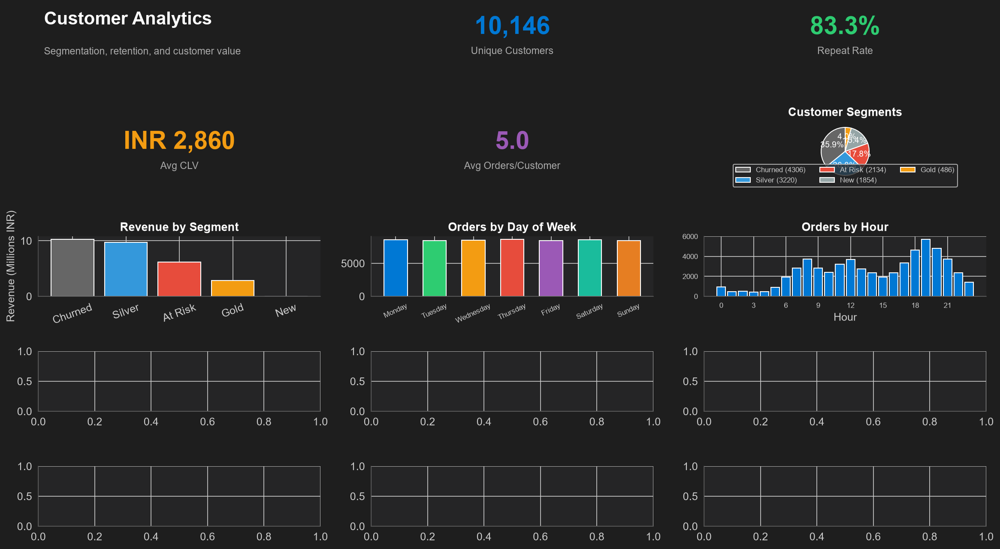 | 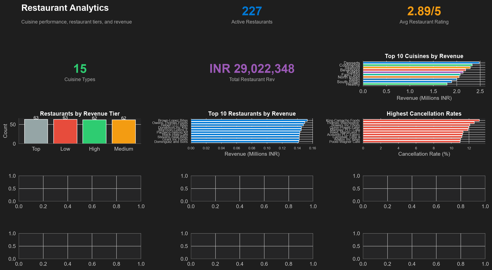 |

| Delivery Operations | Business Insights |
|:---:|:---:|
| 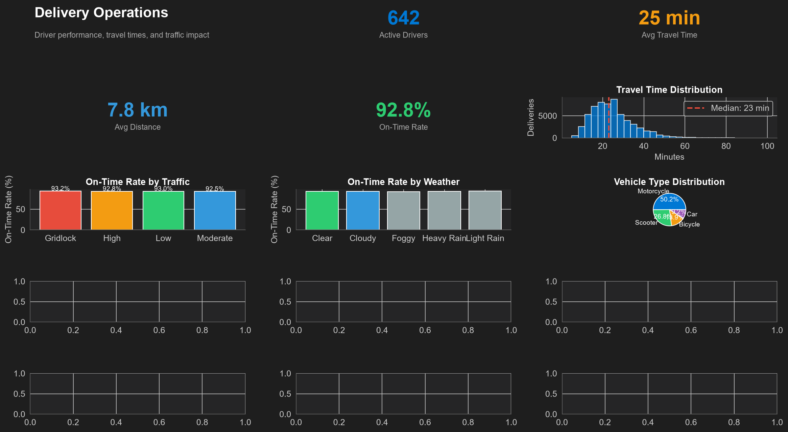 | 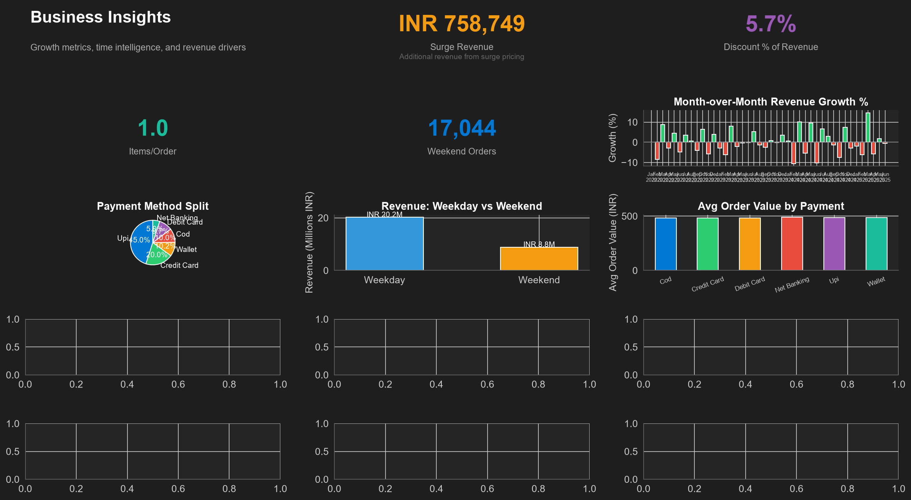 |

All 5 pages are included in the [PbixProj template](dashboard/swiftdash_dashboard.pbip/) — open in Power BI Desktop → Refresh → Save As `.pbix`.

---

## EDA Screenshots

| Monthly Revenue Trend | Customer Segmentation | Top Cuisines |
|:---:|:---:|:---:|
| 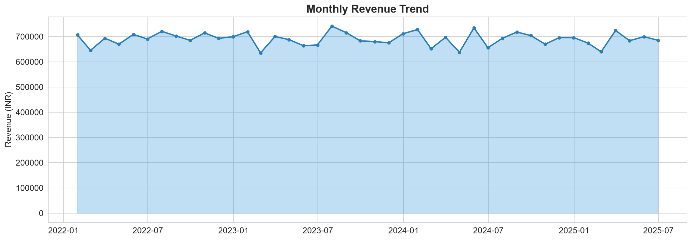 | 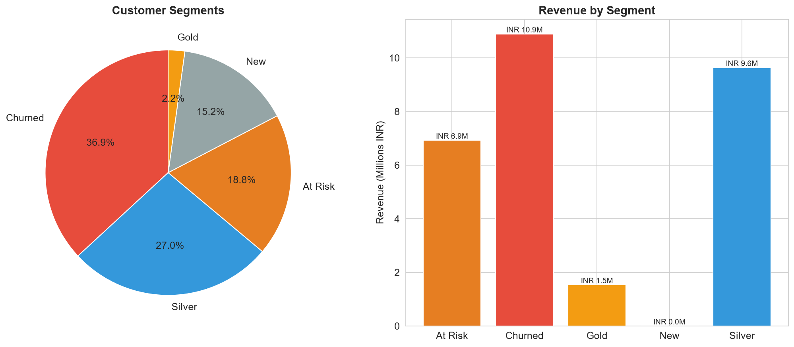 | 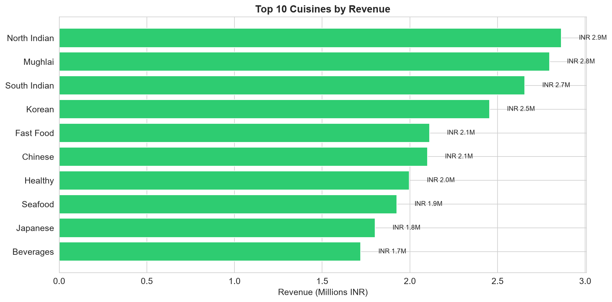 |

| Delivery Performance | Time Patterns | City Revenue |
|:---:|:---:|:---:|
| 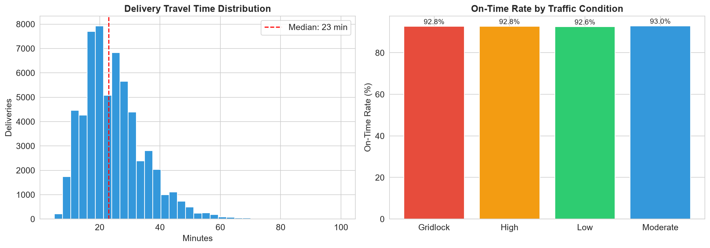 | 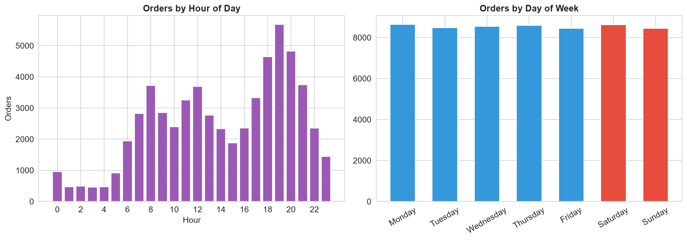 | 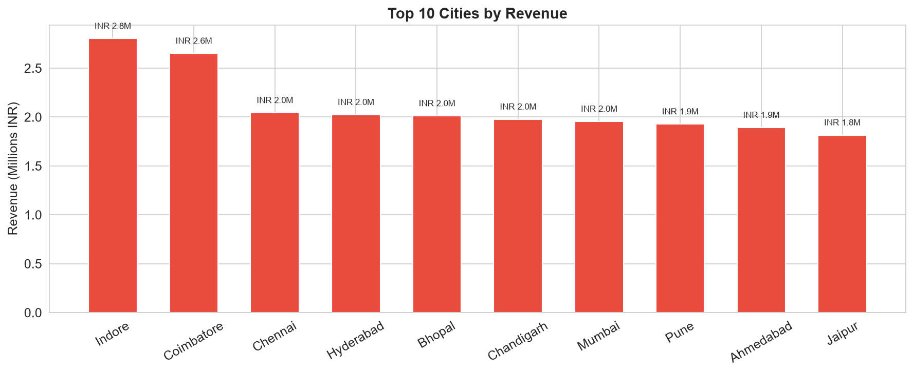 |

---

## Key Insights

**Revenue:** Monthly revenue shows consistent growth with seasonal Q4 peaks. UPI dominates at ~45% of transactions. Discounts under INR 50 show the best ROI; deep discounts (>INR 150) show diminishing returns.

**Customers:** Top 10% of customers contribute ~35-40% of revenue. Platinum + Gold segments (15% of customers) drive 40%+ of revenue. First-month retention drops to ~35-40% — a key improvement area. Age 25-34 is the highest-value segment.

**Operations:** Average delivery time: 25-35 minutes. Motorcycles outperform cars in high traffic (88% vs 72% on-time). Gridlock reduces on-time rates below 60%. Heavy rain increases delivery time by 30%+ and doubles cancellations.

**Restaurants:** North Indian, South Indian, and Chinese cuisines drive 60%+ of total revenue. Restaurants with prep time >30 min have 2x higher cancellation rates. Top 20% of restaurants contribute ~65% of revenue (Pareto).

---

## Business Recommendations

| Priority | Initiative | Expected Impact |
|----------|-----------|----------------|
| P0 | Tiered loyalty program (Platinum/Gold/Silver) | +15% retention, +10% revenue |
| P0 | Dynamic delivery dispatch (more scooters at peak) | +8% on-time rate |
| P1 | Shift from broad discounts to targeted rewards | +5% margin |
| P1 | Marketing investment in high-growth Tier-2 cities | +20% user growth |
| P1 | Reactivation campaigns for At Risk customers | Recover ~15% of churned users |
| P2 | Weather contingency planning (pre-position drivers) | -10% rain-day cancellations |

[Full recommendations report](reports/business_recommendations.md)

---

## Testing

```bash
pytest tests/ -v
# 42 passed
```

- **test_cleaning.py (20 tests):** null handling, outlier clipping, type standardisation, domain validation
- **test_features.py (6 tests):** RFM computation, empty-data edge case, driver scoring, time-series aggregation, cancellation rate accuracy, restaurant feature columns
- **test_pipeline_integrity.py (16 tests):** file existence, row counts, FK integrity, null-key checks

---

## Setup

```bash
# Clone
git clone https://github.com/ShivShah018/food-delivery-operations-analytics.git
cd food-delivery-operations-analytics

# Install dependencies
pip install -r requirements.txt

# Run full pipeline
python run_pipeline.py

# Run tests
pytest tests/ -v

# Open EDA notebook
jupyter notebook notebooks/01_exploratory_data_analysis.ipynb
```

### MySQL (optional)

```sql
-- In your MySQL client
SOURCE sql/01_schema.sql;
```

Then: `python run_pipeline.py` (the MySQL step runs automatically unless you pass `--skip-db`).

### Power BI

```bash
# Generate PbixProj folder from pipeline outputs
python scripts/build_powerbi.py
```

Then open `dashboard/swiftdash_dashboard.pbit` in Power BI Desktop, refresh data, and Save As `.pbix`.

See the [dashboard section](#power-bi-dashboard) above for detailed build instructions.

---

## Skills Demonstrated

- **Python:** Pipeline design, data validation, feature engineering, logging, error handling
- **SQL:** Schema design, window functions, CTEs, cohort analysis, query optimisation
- **Power BI:** DAX measures, data modelling, interactive dashboard design, drill-through
- **Data analysis:** EDA, RFM segmentation, correlation analysis, trend decomposition
- **Testing:** pytest, edge-case coverage, data integrity assertions
- **Engineering:** Modular code, centralised config, one-command pipeline, structured logging
- **Business:** Insight generation, quantified recommendations, implementation roadmapping

---

## Resume-Ready Bullet Points

> Built an end-to-end food delivery analytics platform analysing 65K+ orders across 15 cities using Python (Pandas/NumPy), MySQL, and Power BI.

> Engineered RFM-based customer segmentation (12K customers) and driver efficiency scores, identifying 6 behavioural segments for targeted marketing.

> Wrote 50 analytical SQL queries using window functions, CTEs, and cohort analysis for revenue, retention, and operational KPIs.

> Designed a 5-page Power BI dashboard with 15+ DAX measures, drill-through, and time intelligence for executive decision-making.

> Delivered 6 prioritised business recommendations with quantified ROI, targeting a projected 15% retention improvement and 10% revenue growth.

---

## Additional Resources

- [Data Dictionary](docs/data_dictionary.md)
- [ER Diagram](docs/er_diagram.md)
- [Business Recommendations](reports/business_recommendations.md)
- [Power BI Dashboard Guide](reports/power_bi_dashboard_guide.md)
- [Interview Questions](reports/interview_questions.md) — 22 likely interview Q&As
- [Resume Bullet Points](reports/resume_bullets.md)
- [Development Roadmap](DEVELOPMENT_ROADMAP.md)

---

## License

MIT — see [LICENSE](LICENSE).

---

*Built for placement interviews. Contributions and forks welcome.*
