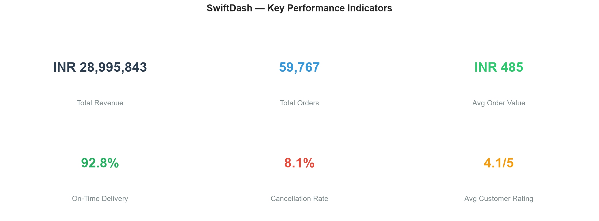

# SwiftDash Food Delivery — Operations & Customer Analytics

An end-to-end data analytics project focused on a food delivery platform. This project demonstrates the complete analytics workflow — from raw data to business insights — using Python, MySQL, and Power BI.

Built as a portfolio project for Data Analyst / BI internship and placement interviews.

---

## Project Overview

**Domain:** Food Delivery / Quick Commerce  
**Timeline:** January 2022 -- June 2025 (3.5 years of simulated transactional data)  
**Scale:** 65,000+ orders | 12,000 customers | 250 restaurants | 800 delivery partners | 15 cities

### Business Problem

The food delivery platform has been collecting transactional data but lacks a structured analytics system to answer basic business questions:

- Who are our most valuable customers, and are we retaining them?
- Which restaurants, cuisines, and menu items drive the most revenue?
- How efficient is our delivery operations, and what affects on-time performance?
- What are the revenue trends, seasonal patterns, and growth opportunities?
- Where should we focus marketing and operational improvement efforts?

**Objective:** Convert raw transaction logs into actionable business intelligence through a structured data pipeline, SQL analysis, and an interactive dashboard.

---

## Tech Stack

| Component | Technology |
|-----------|-----------|
| Language | Python 3.14 |
| Data Processing | Pandas, NumPy |
| Data Visualization | Matplotlib, Seaborn |
| Database | MySQL 8.0 |
| SQL Analysis | 50 queries (CTEs, window functions, joins, aggregations) |
| Dashboard | Power BI (DAX, drill-through, time intelligence) |
| Development | Jupyter Notebook, Git, GitHub |

---

## Dataset

The dataset is synthetically generated using Python (Faker + NumPy) with realistic patterns — peak-hour ordering, weekday/weekend variation, weather impact on deliveries, and seasonal trends.

| Table | Rows | Description |
|-------|------|-------------|
| `customers` | 12,000 | Demographics, signup date, city, activity flag |
| `restaurants` | 250 | Cuisine type, rating, prep time, location |
| `drivers` | 800 | Vehicle type, rating, join date, location |
| `orders` | 65,000 | Order value breakdown, payment, status, ratings |
| `order_items` | 134,383 | Items per order, categories, pricing |
| `delivery_logs` | 59,767 | Travel time, distance, traffic, weather, on-time flag |

[Full Data Dictionary](docs/data_dictionary.md) | [ER Diagram](docs/er_diagram.md)

---

## Project Structure

```
swiftdash-ops-analytics/
│
├── data/
│   ├── raw/                   # Raw generated CSVs
│   ├── cleaned/               # Cleaned and validated data
│   └── processed/             # Feature-engineered tables
│
├── scripts/
│   ├── generate_data.py           # Generate synthetic dataset
│   ├── clean_data.py              # Data cleaning and validation
│   ├── feature_engineering.py     # RFM, segmentation, aggregations
│   ├── generate_visualizations.py # Save EDA charts as images
│   └── load_to_mysql.py           # Bulk load CSVs into MySQL
│
├── notebooks/
│   └── 01_exploratory_data_analysis.ipynb
│
├── sql/
│   ├── 01_schema.sql              # Database table definitions
│   ├── 02_revenue_analysis.sql    # 10 queries: revenue, trends, growth
│   ├── 03_customer_analysis.sql   # 10 queries: segmentation, RFM, retention
│   ├── 04_operational_analysis.sql# 10 queries: delivery, driver efficiency
│   ├── 05_restaurant_analysis.sql # 10 queries: cuisine, items, performance
│   └── 06_kpi_dashboard.sql       # 10 queries: KPIs, platform economics
│
├── reports/
│   ├── business_recommendations.md
│   ├── power_bi_dashboard_guide.md
│   ├── interview_questions.md
│   └── resume_bullets.md
│
├── docs/
│   ├── data_dictionary.md     # Column-level documentation
│   └── er_diagram.md          # Entity-relationship diagram
│
├── dashboard/                 # Power BI file (.pbix)
├── screenshots/               # EDA chart exports
├── requirements.txt
├── DEVELOPMENT_ROADMAP.md
└── README.md
```

---

## Pipeline Workflow

```
Generate synthetic data  ──>  Clean & validate  ──>  Feature engineering
         │                          │                        │
    Raw CSVs                   Cleaned CSVs             Processed tables
         │                          │                        │
         └──────────────────────────┴────────────────────────┘
                                    │
                             Load to MySQL
                                    │
                         50 analytical SQL queries
                                    │
                          Power BI dashboard
                                    │
                     Business insights & recommendations
```

---

## SQL Analysis — 50 Queries

Queries are organized into 5 categories. Each file contains 10 queries with comments explaining the business logic.

| Category | File | Topics Covered |
|----------|------|----------------|
| Revenue | `02_revenue_analysis.sql` | Monthly trends, MoM growth, payment method analysis, city revenue, hourly patterns, discount impact, weekday vs weekend |
| Customer | `03_customer_analysis.sql` | RFM segmentation, lifetime value, repeat rate, cohort retention, age/gender analysis, acquisition trends, discount behavior |
| Operations | `04_operational_analysis.sql` | Delivery time by hour/traffic/weather, driver ranking, vehicle comparison, peak hours, outlier detection, refund analysis |
| Restaurant | `05_restaurant_analysis.sql` | Top performers, cuisine performance, popular items, cross-selling, cancellation rates, revenue concentration (Pareto) |
| KPI Dashboard | `06_kpi_dashboard.sql` | Executive scorecard, MoM comparison, top 10% contribution, daily active users, payment trends, cohort retention, platform economics |

### SQL Techniques Used:
- Window functions: `LAG()`, `ROW_NUMBER()`, `NTILE()`, `DENSE_RANK()`
- Common Table Expressions (CTEs) for multi-step transformations
- Aggregate functions with `GROUP BY` and `ROLLUP` patterns
- Conditional aggregation using `CASE WHEN`
- Self-joins for cross-selling (market basket) analysis
- Subqueries and correlated subqueries
- `DATE_FORMAT`, `TIMESTAMPDIFF`, and date arithmetic

---

## Power BI Dashboard

The interactive dashboard consists of 5 pages designed for different user personas:

| Page | Target User | Key Visuals |
|------|-------------|-------------|
| **Executive Summary** | Management | KPI cards, revenue trend, city bar chart, payment donut |
| **Customer Analytics** | Marketing | Segment treemap, demographics, cohort matrix, acquisition trend |
| **Operations & Delivery** | Operations | Delivery time distribution, on-time rates, driver table, city map |
| **Restaurant & Menu** | Business Dev | Top restaurants, cuisine share, popular items, rating scatter |
| **Trends & Insights** | Strategy | Monthly forecast, YoY growth, weekday heatmap, discount analysis |

### Key DAX Measures
- `Total Revenue`, `Total Orders`, `Avg Order Value`
- `On-Time Delivery %`, `Cancellation Rate`
- `Revenue MoM Growth`, `Revenue YoY Growth`
- `Repeat Customer Rate`
- `Avg Customer Lifetime Value`
- `Dynamic Customer Segmentation`

[Detailed Dashboard Build Guide](reports/power_bi_dashboard_guide.md)

---

## Key Insights

**Revenue:**
- Monthly revenue shows consistent growth with seasonal peaks in Q4 (festive season)
- UPI dominates at ~45% of transactions, followed by Credit Cards at ~20%
- Discounts under 50 INR show the best ROI; deep discounts (>150 INR) show diminishing returns

**Customers:**
- Top 10% of customers contribute ~35-40% of total revenue
- Platinum + Gold segments (15% of customers) drive 40%+ of revenue
- First-month retention drops to ~35-40% -- a key area for improvement
- Age group 25-34 is the highest-value customer segment

**Operations:**
- Average delivery time: 25-35 minutes
- Motorcycles outperform cars in high-traffic conditions (88% vs 72% on-time rate)
- Gridlock traffic reduces on-time rates below 60%
- Heavy rain increases delivery time by 30%+ and doubles cancellation rates

**Restaurants:**
- North Indian, South Indian, and Chinese cuisines drive 60%+ of total revenue
- Restaurants with prep time over 30 minutes have 2x higher cancellation rates
- The top 20% of restaurants contribute ~65% of revenue (Pareto principle)

---

## Business Recommendations

| Priority | Initiative | Expected Impact |
|----------|-----------|----------------|
| P0 | Tiered loyalty program (Platinum/Gold/Silver) | +15% retention, +10% revenue |
| P0 | Dynamic delivery dispatch (more scooters at peak hours) | +8% on-time rate |
| P1 | Shift from broad discounts to targeted loyalty rewards | +5% margin |
| P1 | Increase marketing spend in high-growth Tier-2 cities | +20% new user growth |
| P1 | Reactivation campaigns for At Risk customers | Recover 15% of churned users |
| P2 | Weather contingency planning for delivery network | -10% rain-day cancellations |

[Full Recommendations Report](reports/business_recommendations.md)

---

## Setup Instructions

### Prerequisites
- Python 3.10 or higher
- MySQL 8.0+ (optional for SQL analysis -- queries can also be read as reference)
- Power BI Desktop (for building/opening the dashboard)
- Git

### Installation

```bash
# Clone the repository
git clone https://github.com/your-username/swiftdash-ops-analytics.git
cd swiftdash-ops-analytics

# Install Python dependencies
pip install -r requirements.txt

# Step 1: Generate the dataset
python scripts/generate_data.py

# Step 2: Clean and validate data
python scripts/clean_data.py

# Step 3: Feature engineering (RFM, segments, aggregations)
python scripts/feature_engineering.py

# Step 4 (optional): Load into MySQL
# First run sql/01_schema.sql in your MySQL client
python scripts/load_to_mysql.py

# Step 5: Generate EDA screenshots
python scripts/generate_visualizations.py

# Step 6: Open the Jupyter notebook
jupyter notebook notebooks/01_exploratory_data_analysis.ipynb

# Step 7: Open Power BI
# Launch dashboard/swiftdash_dashboard.pbix in Power BI Desktop
```

---

## Screenshots

| Monthly Revenue Trend | Customer Segmentation | Top Cuisines |
|:---:|:---:|:---:|
|  |  |  |

| Delivery Performance | Time Patterns | City Revenue |
|:---:|:---:|:---:|
|  |  |  |

| KPI Summary Dashboard |
|:---:|
|  |

---

## Skills Demonstrated

- **Python (Pandas/NumPy):** Data generation, cleaning, validation, transformation, feature engineering
- **SQL (MySQL):** Schema design, complex queries, window functions, CTEs, query optimization, indexing
- **Power BI:** Data modeling, DAX measures, interactive dashboard design, drill-through, time intelligence
- **Data Analysis:** Exploratory analysis, RFM segmentation, cohort analysis, correlation analysis, trend analysis
- **Business Communication:** Insight generation, data-driven recommendations, technical documentation, presentation-ready reports

---

## Additional Resources

- [Data Dictionary](docs/data_dictionary.md) -- Column-by-column documentation for all tables
- [ER Diagram](docs/er_diagram.md) -- Entity-relationship diagram with schema details
- [Business Recommendations](reports/business_recommendations.md) -- Detailed recommendations with implementation roadmap
- [Power BI Dashboard Guide](reports/power_bi_dashboard_guide.md) -- Step-by-step dashboard build instructions
- [Interview Questions](reports/interview_questions.md) -- 20+ likely interview questions with answers
- [Resume Bullet Points](reports/resume_bullets.md) -- Ready-to-use bullet points for your resume
- [Development Roadmap](DEVELOPMENT_ROADMAP.md) -- Project phasing and future enhancements
