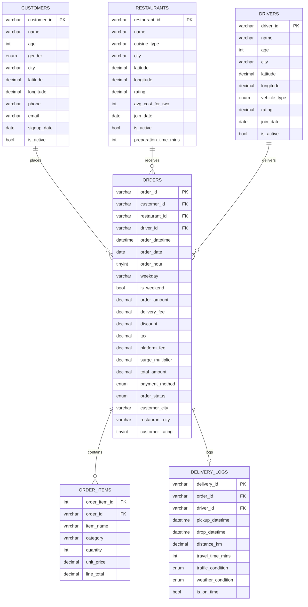

# Entity-Relationship Diagram — SwiftDash Database

## Schema Diagram (Mermaid)

## Relationship Summary

| Parent | Child | Relationship Type | Description |
|--------|-------|------------------|-------------|
| `customers` | `orders` | One-to-Many | A customer can place many orders |
| `restaurants` | `orders` | One-to-Many | A restaurant can receive many orders |
| `drivers` | `orders` | One-to-Many | A driver can fulfill many orders |
| `orders` | `order_items` | One-to-Many | An order contains multiple items |
| `orders` | `delivery_logs` | One-to-One | Each delivered order has one delivery log |

## Key Design Decisions

1. **Central fact table:** `orders` sits at the center connecting customers, restaurants, and drivers — enabling multi-dimensional analysis in a single JOIN.

2. **Denormalized city fields:** `customer_city` and `restaurant_city` in the `orders` table avoid extra JOINs for city-level aggregations (a common analytics optimization).

3. **Delivery logs as separate table:** Rather than adding delivery fields to `orders`, a separate `delivery_logs` table keeps operational data distinct from transactional data. This also allows for one-to-one mapping (one delivery log per delivered order).

4. **Surge multiplier stored per order:** Captures the actual surge applied at order time, enabling "what-if" revenue analysis (revenue with and without surge).

5. **Nullable driver_id:** When an order is cancelled, no driver is assigned, so the FK is nullable.

6. **Indexes on high-query columns:** `order_date`, `customer_id`, `restaurant_id`, `order_status`, and `payment_method` are indexed for frequent WHERE and JOIN clauses.
